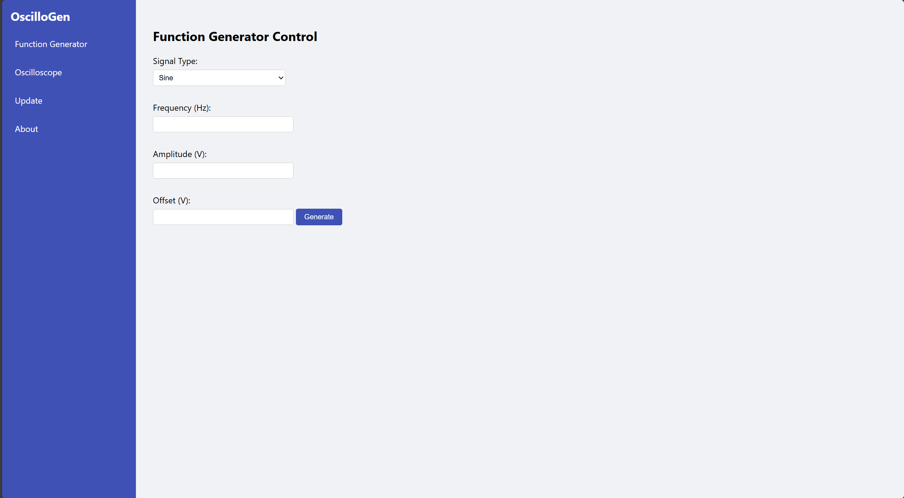
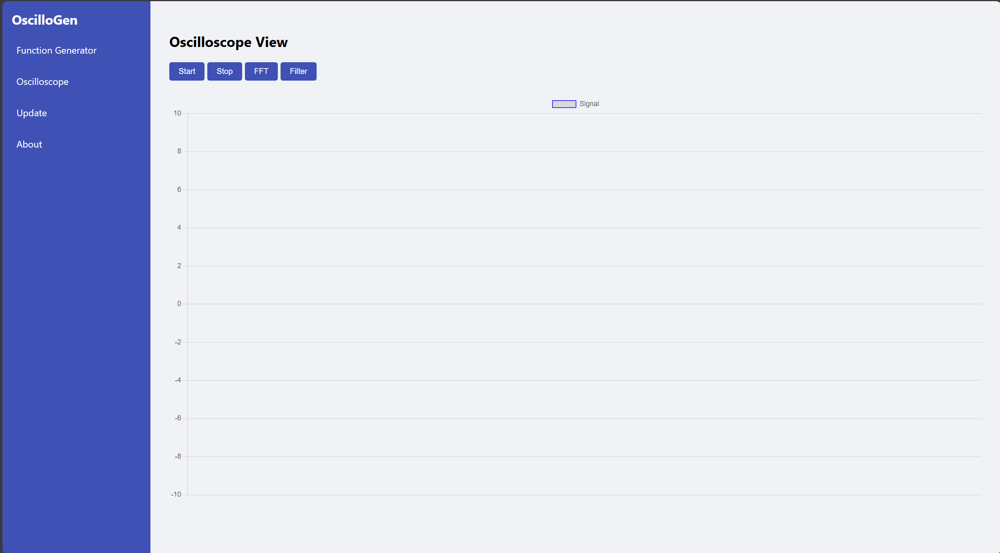
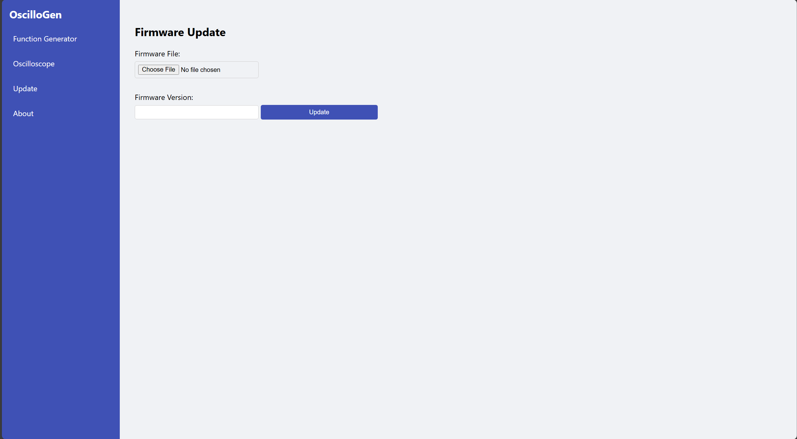
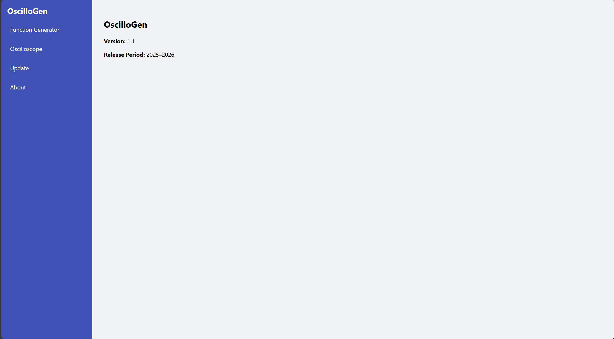

## Modular Signal Control & Visualization Platform (WEB_OscilloGen-Cloud)

OscilloGen is a full-stack signal generation and analysis platform designed for embedded systems, industrial gateways, and educational labs. It integrates a Django web interface with a C++ MQTT gateway connected to a function generator, enabling real-time waveform control, oscilloscope visualization, and firmware updates.

---

## Features

- **Function Generator Control**  
  Set waveform type, frequency, amplitude, and offset via a web GUI. Commands are sent to the gateway over MQTT.

-  **Oscilloscope Visualization**  
  Live waveform plotting from telemetry data published by the function generator. Includes Start/Stop, FFT, and Filter controls.

-  **Firmware Update Interface**  
  Upload firmware files and version info to trigger gateway-side flashing.

-  **About Page**  
  Displays version, release period, and project description.

---










---

## Architecture

```
[User Browser]
     ↓
[Django Web App] ←→ [SQLite DB]
     ↓
[MQTT Broker]
     ↓
[C++ Gateway] ←→ [Function Generator]
```

- Django publishes MQTT commands and logs telemetry.
- Gateway subscribes to commands and publishes waveform samples.
- Function generator is controlled via serial/SPI from the gateway.

---

## Setup Instructions

### 1. Clone the Repository

```bash
git clone https://github.com/ShayanEram/OscilloGen.git
cd OscilloGen
```

### 2. Install Dependencies

```bash
python -m venv venv
source venv/bin/activate
pip install -r requirements.txt
```

### 3. Apply Migrations

```bash
python manage.py makemigrations
python manage.py migrate
```

### 4. Run the Server

```bash
python manage.py runserver
```

Visit `http://127.0.0.1:8000/`

---

## MQTT Topics

| Topic | Description |
|-------|-------------|
| `gateway/001/commands/functiongen/{parameter}` | Control waveform settings (e.g. frequency, amplitude) |
| `gateway/001/telemetry/waveform` | Live waveform samples |
| `gateway/001/commands/oscilloscope` | Start, Stop, FFT, Filter |
| `gateway/001/commands/firmware/update` | Firmware update trigger |

---

## Gateway Integration

- Built in C++ using `paho.mqtt.cpp` (https://www.emqx.com/en/blog/how-to-use-mqtt-in-django)
- Parses MQTT commands and applies them to the function generator
- Publishes waveform samples to telemetry topic
- Handles firmware flashing logic

---

## Project Structure

```
django_mqtt/
├── django_mqtt/         # Project settings
├── telemetry/           # App: views, models, templates
│   ├── templates/
│   │   └── telemetry/
│   │       ├── base.html
│   │       ├── functiongen.html
│   │       ├── oscilloscope.html
│   │       ├── firmware_update.html
│   │       └── about.html
├── media/               # Uploaded firmware files
├── mqtt.py              # MQTT client integration
├── urls.py              # Route definitions
```

---

## Requirements

- Python 3.10+
- Django 4.x
- paho-mqtt
- Chart.js (via CDN)
- C++ gateway with MQTT support
